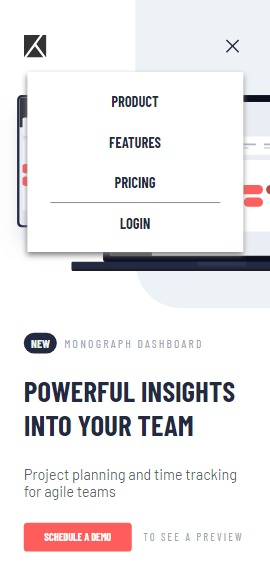
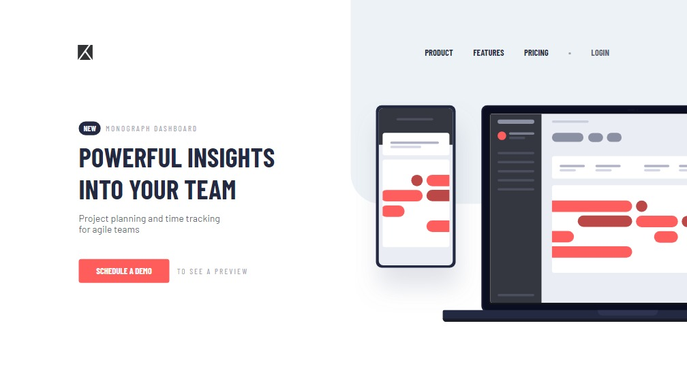

# Frontend Mentor - Project tracking intro component solution

This is a solution to the [Project tracking intro component challenge on Frontend Mentor](https://www.frontendmentor.io/challenges/project-tracking-intro-component-5d289097500fcb331a67d80e). Frontend Mentor challenges help you improve your coding skills by building realistic projects. 

## Table of contents

- [Overview](#overview)
  - [The challenge](#the-challenge)
  - [Screenshot](#screenshot)
  - [Links](#links)
- [Built with](#built-with)
- [Author](#author)

## Overview

### The challenge

Users should be able to:

- View the optimal layout for the site depending on their device's screen size
- See hover states for all interactive elements on the page
- Create the background shape using code

### Screenshot

 
### Links

- Solution URL: [Frontend Mentor Challenge](https://www.frontendmentor.io/challenges/project-tracking-intro-component-5d289097500fcb331a67d80e/hub?share=true)
- Live Site URL: [Project Tracking in Vercel](https://project-tracking-vert.vercel.app)

## My process

#   # Built with

- CSS custom properties
- Flexbox
- CSS Grid
- Mobile-first workflow
- [Vue.js](https://vuejs.org/) - JS library
- [Styled Components](https://styled-components.com/) - For styles

## Author
- Frontend Mentor - [@joshmichael23](https://www.frontendmentor.io/profile/joshmichael23)
- Twitter - [@sadzxcqwerty](https://www.twitter.com/sadzxcqwerty)
